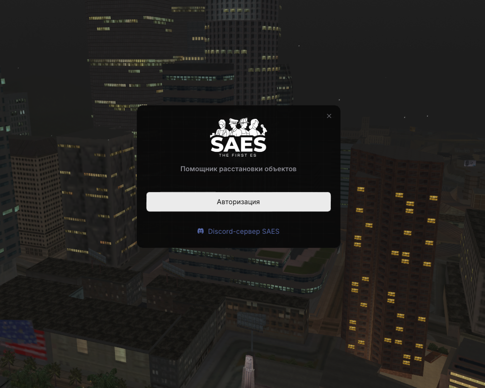
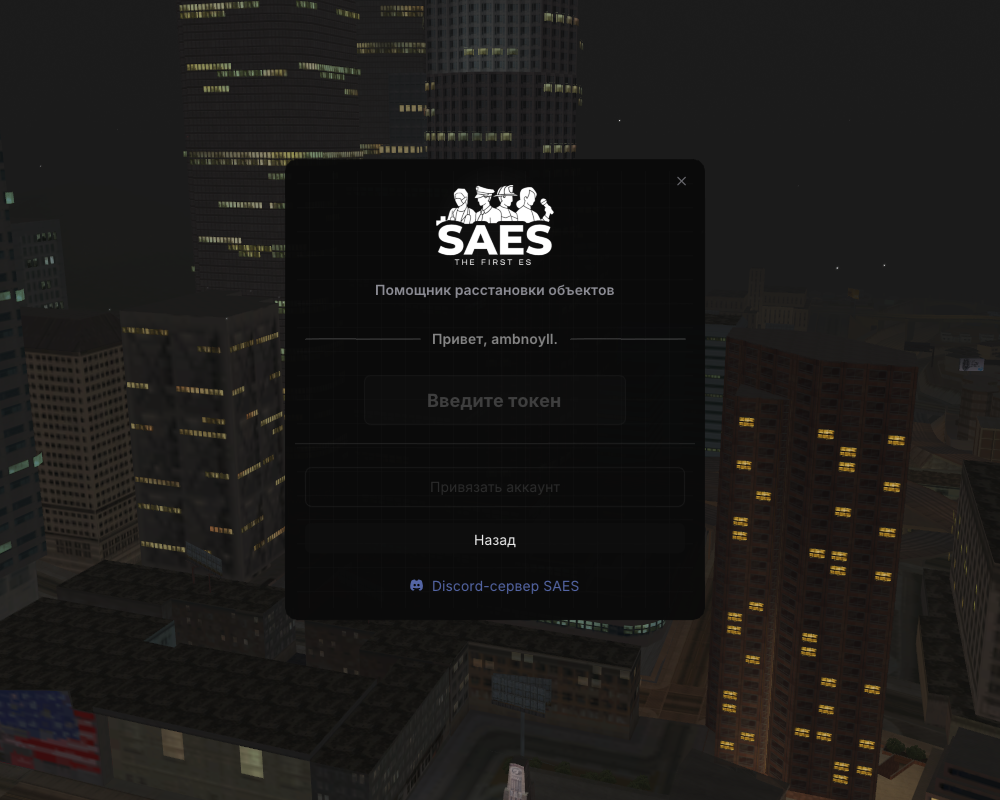
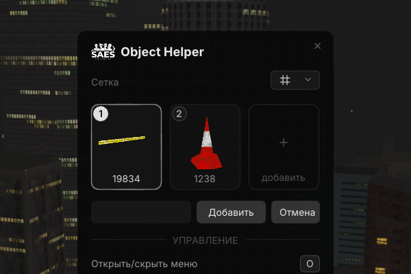
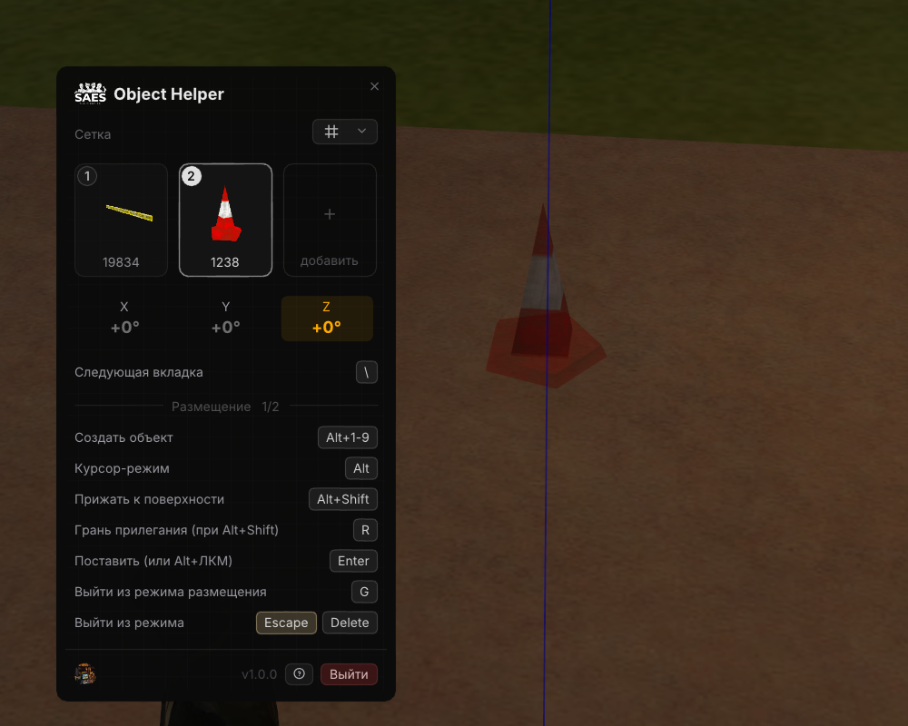
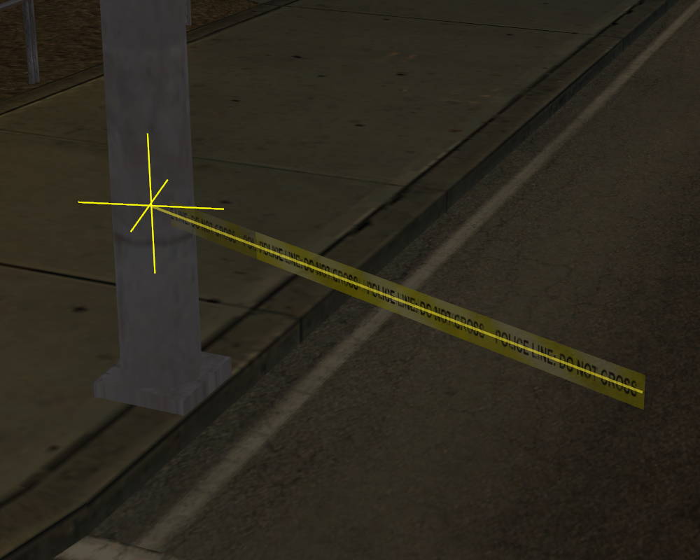
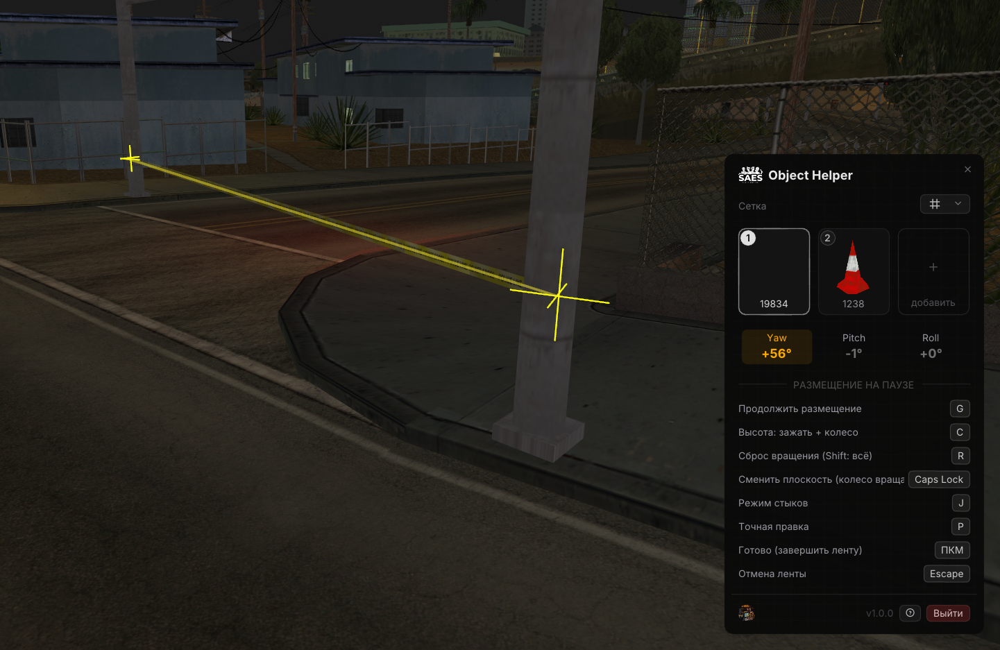
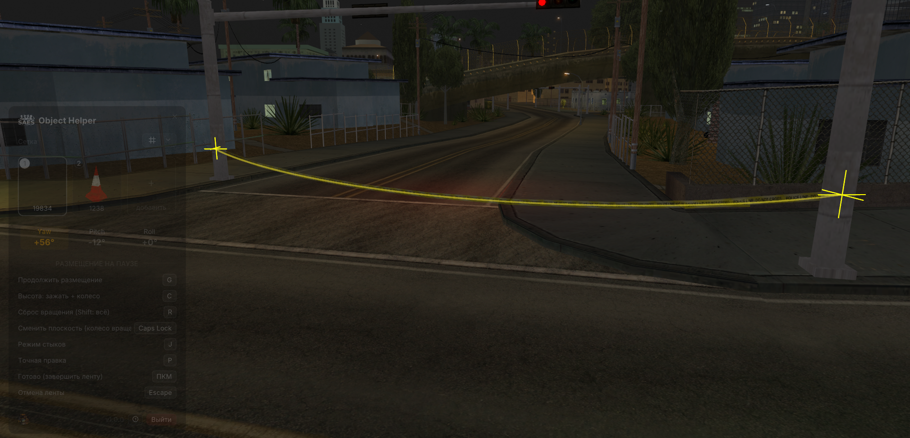
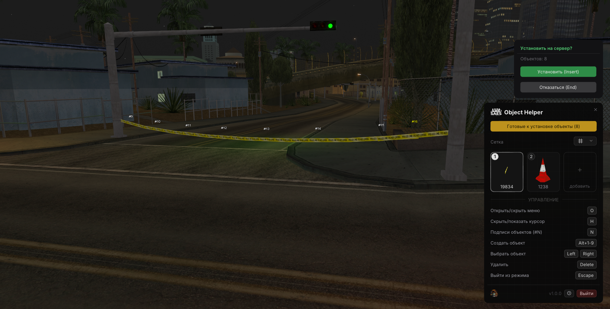

# SAES Object Helper

**Инструмент расстановки объектов для SA:MP (MoonLoader)** — живое 3D-превью, удобный редактор и установка объектов прямо на сервер.

---

## 🔒 Доступ

Для доступа к функционалу скрипта требуется авторизация. Для успешной авторизации необходимо находиться в [Discord-сервере SAES](https://discord.gg/55n5KZkp2n) и иметь фракционные роли любой из фракций. На данном этапе скрипт доступен только игрокам раздела **SAES**.

 

---

## Возможности

- **Палитра объектов** — ячейки быстрого доступа с **живым 3D-превью** модели (EntityRender) и мгновенной сменой модели на лету.
- **Режим редактирования (Edit)** — точная расстановка: перемещение, вращение по осям, **прижатие к поверхности** (snap), привязка к сетке, подсказки осей.
- **Инструмент «Лента»** — ограждения по контрольным точкам: сплайн или прямые отрезки, правка точек, стыки, прогиб и глубина утопления.
- **Серверные объекты** — установка превью **прямо на сервер** (эмуляция RPC): по одному или пачкой; список установленных с удалением по радиусу или поштучно.
- **Пресеты** — сохранение и загрузка наборов объектов.
- **Undo / Redo** — полная история действий (`Ctrl+Z` / `Ctrl+Y`), включая откат установки на сервер.
- **Гибкие хоткеи** — любую клавишу можно переназначить прямо в меню.

---

## Как это работает

Единый пайплайн: от выбора модели до готовой сцены, расставленной **прямо на сервере**.

### 1. Палитра с живым превью
Объекты лежат в ячейках быстрого доступа, и каждая показывает **живую 3D-модель с авто-вращением** (рендер через EntityRender) — видно, что берёшь, ещё до установки. Модель в ячейке меняется на лету, новую добавляешь по ID.

### 2. Точная расстановка (Edit-режим)
Берёшь объект «в руку» и правишь положение и поворот **по осям** — активная ось подсвечивается прямо в мире (на скрине — красная), так что вращаешь именно вокруг нужной. Плюс привязка к сетке и сдвиги камеро-относительно.

### 3. Прижатие к поверхности и опорные точки
Объекты и точки **прилипают к поверхности** — лента/ограждение ложится ровно по бордюру, стене или столбу, без зазоров. Ставишь опорные точки — между ними построится участок.

### 4. Лента по контрольным точкам
Инструмент **«Лента»** соединяет опорные точки плавным сплайном (или прямыми отрезками — для острых углов). На скрине — лента в режиме редактирования между двумя точками.

### 5. Тонкие правки для достоверного вида
Набор параметров, чтобы лента выглядела как настоящая: **прогиб по вертикали** (на скрине красиво провисает между столбами), глубина утопления, стыки, правка отдельных точек, плоский режим.

### 6. Сохранение и установка на сервер
Готовую расстановку **сохраняешь в превью одной клавишей** (ПКМ, настраивается). Дальше — отдельное **меню серверных объектов** и всплывающая **нотификация «Установить на сервер?»**: объекты ставятся на сервер **по одному, последовательно** (с задержками и защитой от флуда), со сводкой по итогу и откатом по `Ctrl+Z`.

---

## Режим «Лента» — все возможности

Лента строит **цельное ограждение / полицейскую ленту по контрольным точкам** — от простого отрезка до сложной трассы с провисанием и стыками. Все клавиши **переназначаются** в меню; ниже — действия по умолчанию.

**Построение**
- **Контрольные точки** — `Alt+ЛКМ` ставит точку, между точками автоматически тянется лента.
- **Сплайн или прямые** — по умолчанию плавный сплайн; `M` переключает на прямые отрезки (острые углы).
- **Прижатие к поверхности** — `Alt+Shift`: точки и лента ложатся по бордюру / стене / столбу без зазоров.
- **Курсор-режим** — `Alt`; **перетаскивание с сохранением позиции** — `Ctrl+Alt`.
- **Готово** — `ПКМ`: финализирует ленту в объекты.

**Форма и достоверный вид**
- **Прогиб** — лента провисает между опорами: `↑`/`↓` — вперёд/назад, `Shift+↑`/`↓` — вверх/вниз (вертикальное провисание, как у настоящей).
- **Высота узла** — `C` + колесо мыши.
- **Глубина утопления** — `,` / `.` : насколько лента «втоплена» в поверхность.
- **Плоская лента** — `F`: выровнять участок в плоскость.
- **Вращение участка** — колесо мыши (`2°`, `Shift 5°`, `Ctrl 0.25°`); смена плоскости вращения — `CapsLock`.

**Правка готовой ленты**
- **Выбор участка** — `←`/`→`, активный сегмент подсвечивается.
- **Правка точек** (`P`) — двигать узел камеро-относительно: `I`/`K` — вперёд/назад, `J`/`L` — влево/вправо; тащить мышью `Ctrl+Alt`; выбор цели `[` / `]`.
- **Режим стыков** (`J`) — добавлять/править швы между сегментами: выбор шва `←`/`→`, навести на ближайший `Alt`, добавить точку `Alt+ЛКМ`.
- **Сброс вращения** — `R` (а `Shift+R` — сбросить всё).
- **Пошаговый откат** — `Ctrl+Z`.

---

## 📦 Установка

1. Скачайте файлы из этого репозитория (кнопка **Code → Download ZIP** или клон).
2. Разложите по папке `moonloader`:
   | Из репозитория | Куда |
   |---|---|
   | `ObjMapper.lua` | `moonloader/` |
   | содержимое `lib/` | `moonloader/lib/` |
   | содержимое `resource/` | `moonloader/resource/` |
3. Запустите игру (или `/script load`). В чат придёт приветствие — откройте меню командой **`/objhelper`**.

**Требования:** актуальный **MoonLoader**, **SA:MP 0.3.7**, **mimgui**. Остальные зависимости (EntityRender, effil, lfs, socket и др.) уже лежат в `lib/`.

> 🔄 Дальше скрипт **обновляется сам** — повторно качать вручную не нужно (см. ниже).

---

## 🎮 Команды и горячие клавиши

**Команда:** `/objhelper` — открыть / закрыть меню.

Основные клавиши (**все переназначаются прямо в меню**):

| Клавиша | Действие |
|---|---|
| `O` | Открыть / закрыть меню |
| `H` | Скрыть курсор / отдать управление игре |
| `1`–`9` | Выбрать объект из палитры |
| `Alt` + `1`–`9` | Активировать инструмент с этим объектом |
| `Enter` | Поставить preview (в edit-режиме) |
| `Insert` | Установить **все** preview на сервер |
| `End` | Отклонить предложение установки |
| `←` / `→` | Переключение между preview-объектами |
| `G` | Выйти из режима размещения |
| `R` | Сброс вращения |
| `Ctrl`+`Z` / `Ctrl`+`Y` | Отменить / повторить |

**Инструмент «Лента»:** `F` — плоская, `M` — без сплайна (прямые отрезки), `J` — стыки, `P` — правка точек, `C` — высота, `I/J/K/L` — сдвиг точки, `[` `]` — выбор цели, `,` `.` — глубина.

> Полный актуальный список — в блоке **«Управление»** внутри меню (страницы листаются клавишей `\`).

---

## 🔄 Автообновление

При запуске скрипт сверяет свою версию с этим репозиторием. Если вышла новее — в меню появляется баннер **«Обновить»** с описанием изменений, а в чат приходит уведомление. По кнопке скрипт **сам скачивает, проверяет и устанавливает** новую версию и перезагружается — ручных действий не требуется.

---

## 💬 Поддержка

- **Discord SAES:** https://discord.gg/55n5KZkp2n
- Вопросы, предложения и баг-репорты — через **тикеты** на Discord-сервере.

---

**Автор:** sexorcist

